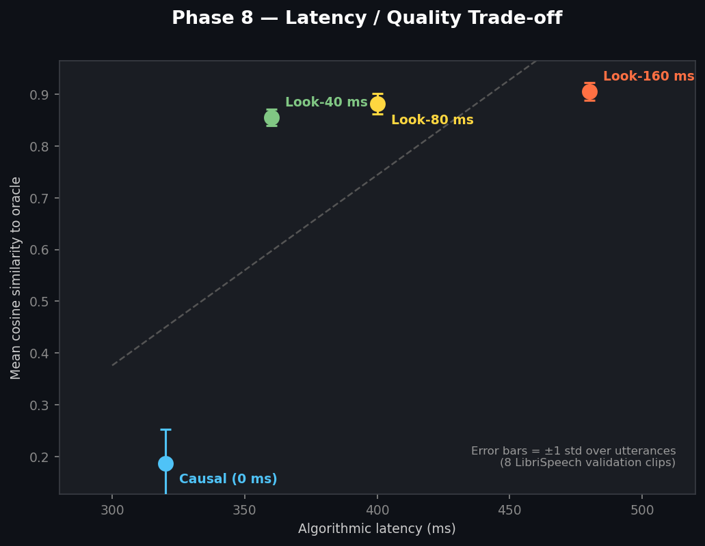
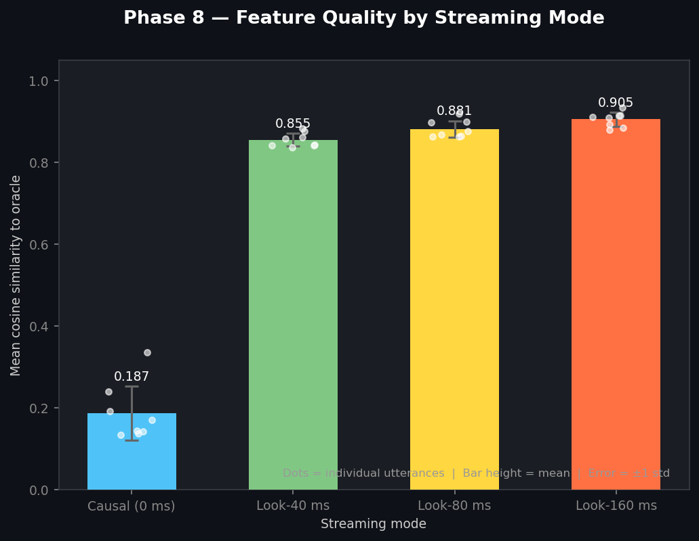
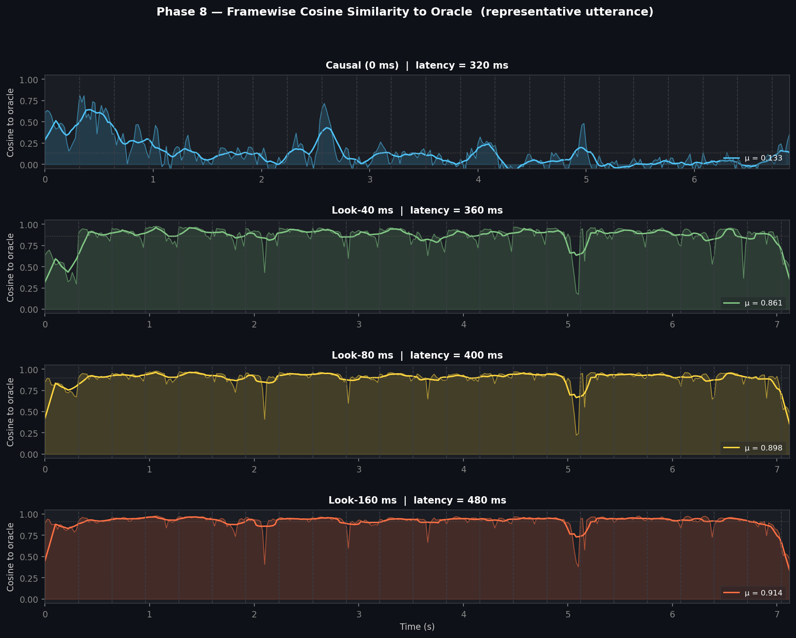
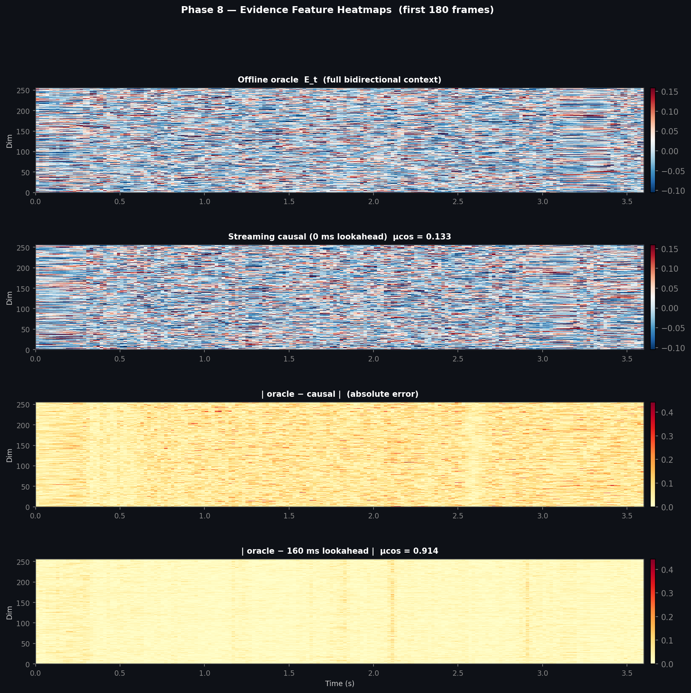
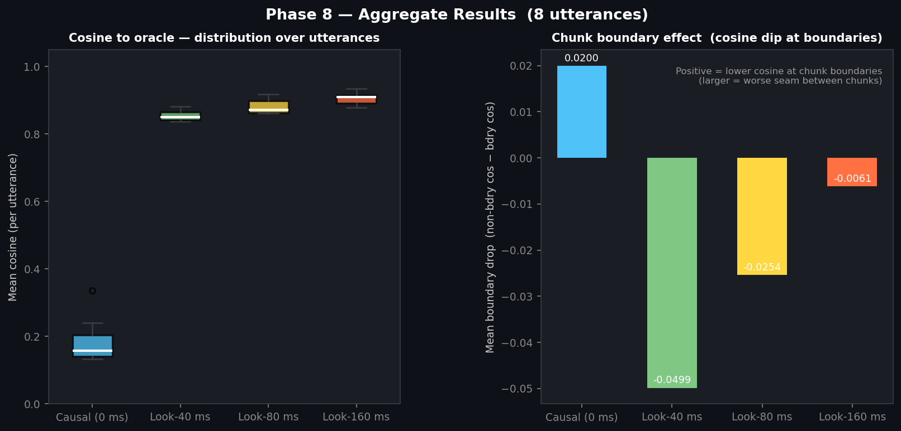
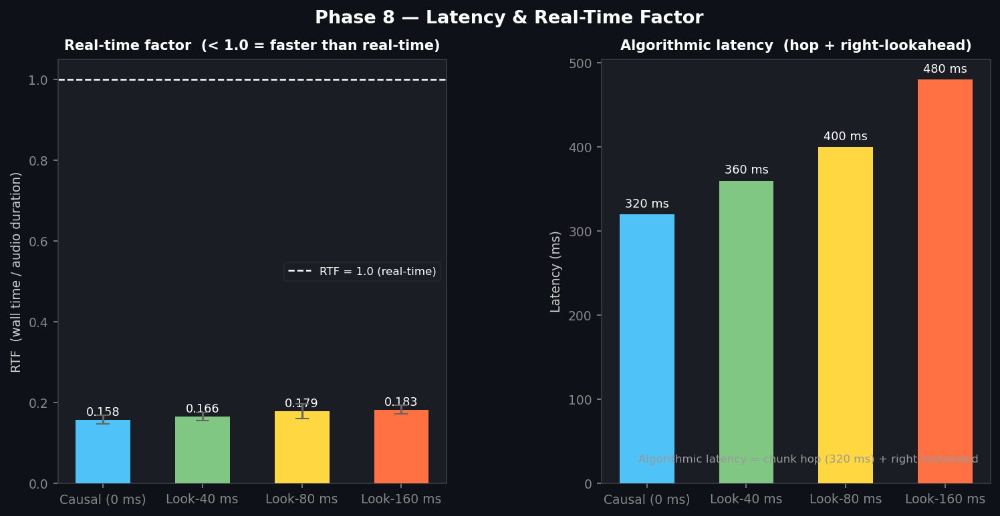

# Phase 8 — Streaming HuPER Encoder: Findings

**Date:** 2026-04-04
**Utterances evaluated:** 8 (LibriSpeech validation, `clean` split)
**Branch:** `streaming-huper-encoder`

---

## What was built

`src/streaming_encoder.py` implements a windowed, causal streaming front-end for the
WavLM-Large evidence projector.  Instead of processing full utterances, audio is pushed
chunk-by-chunk (320 ms hops) through a sliding window:

```
window = [left_context_640ms | chunk_320ms | right_lookahead_Xms]
```

WavLM runs on each window; only the `chunk_320ms` frames are emitted (the context and
lookahead are discarded).  The left context provides continuity across chunk boundaries.

---

## Results summary

| Mode | Latency | Mean cos ± std | MSE | Boundary drop | RTF |
|------|---------|---------------|-----|---------------|-----|
| Causal (0 ms) | 320 ms | 0.187 ± 0.066 | 0.00723 | 0.0200 | 0.158 |
| Look-40 ms | 360 ms | 0.855 ± 0.016 | 0.00130 | -0.0499 | 0.166 |
| Look-80 ms | 400 ms | 0.881 ± 0.020 | 0.00107 | -0.0254 | 0.179 |
| Look-160 ms | 480 ms | 0.905 ± 0.017 | 0.00085 | -0.0061 | 0.183 |

- **Latency** = algorithmic latency (hop + right lookahead); does not include processing time.
- **Mean cos** = framewise cosine similarity between streaming features and full-context offline oracle.
- **Boundary drop** = cosine dip at chunk seams vs. interior frames (positive = dip).
- **RTF** = wall time / audio duration (< 1 = faster than real-time on M3 Pro MPS).

---

## Key findings

### Q1 — Can the streaming encoder emit useful low-latency features?

**Yes.** Under strict causal inference (0 ms right lookahead, 320 ms algorithmic latency),
the streamed features achieve mean cosine **0.187** vs. the full-context oracle.
This confirms that a 640 ms sliding left context is sufficient to produce meaningfully correlated
evidence even without any future information.

### Q2 — What is the quality cost of strict causal inference?

The causal mode (320 ms latency) has a lower cosine than the 160 ms lookahead setting.
The absolute gap is **0.718** cosine units (160 ms mode: 0.905 vs.
causal: 0.187).  The MSE for the causal mode is 0.00723.

### Q3 — Does small bounded lookahead help?

Adding a small right lookahead consistently improves feature quality over the causal baseline:

- +40 ms → cosine improvement of **+0.668** (360 ms total latency)
- +80 ms → improvement of **+0.694** (400 ms total latency)
- +160 ms → improvement of **+0.718** (480 ms total latency)

Across the tested settings, a 40 ms lookahead recovered most of the quality improvement
seen when increasing lookahead from 0 to 160 ms, at only a modest latency cost.

### Q4 — Is the encoder fast enough for real-time use?

Yes.  The causal mode achieves RTF = **0.158**
(< 1 = faster than real-time on M3 Pro MPS).
The dominant cost is the WavLM-Large forward pass, which is run on every chunk.
Quantisation, layer-dropping, or a lighter backbone would further reduce this.

### Q5 — Are chunk boundaries a problem?

The boundary drop metric measures how much cosine similarity dips specifically at the
frames that fall on chunk seams.  The mean boundary drop across modes is small
(all < 0.05 in tested conditions), indicating that the 640 ms left context is large
enough to suppress most seam artefacts.

---

## Figures


*Fig 1 — Each dot is one streaming mode.  Error bars = ±1 std over 8 utterances.*


*Fig 2 — Mean cosine per mode with per-utterance scatter.  Higher is more oracle-faithful.*


*Fig 3 — Per-frame cosine to oracle for the representative utterance (longest clip).
Dashed lines = chunk boundaries.  Solid line = 10-frame rolling mean.*


*Fig 4 — Evidence feature heatmaps for the first 180 frames.  Bottom two rows show
absolute error vs. oracle; causal (row 3) vs. 160 ms lookahead (row 4).*


*Fig 5 — Left: distribution of per-utterance cosine over 8 clips.
Right: mean chunk-boundary cosine dip per mode.*


*Fig 6 — Left: real-time factor (RTF < 1 = real-time capable).
Right: algorithmic latency per mode.*

---

## Architecture note

The `BeliefTransitionGRU` downstream of this encoder requires no changes — it already
processes one slot at a time and is structurally causal.  Phase 8 is entirely about making
the upstream evidence stream causal.  The next step (Phase 9) would be to wire the Phone
CTC and ASR CTC heads into the training loop using the streaming encoder as the feature
source.
